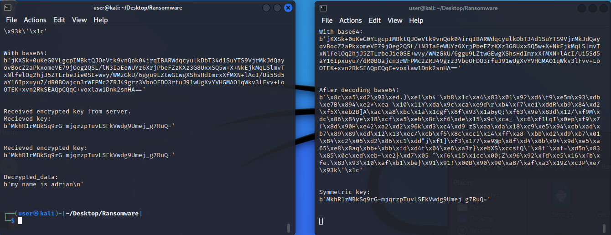

### Summary

Covers common algorithms and techniques that underly how modern day cryptography works.
Showcases how ransomware is implemented with publickey crpytography that encrypts one or multiple files. 

Built a client that generates a symmetrical key, encrypts a txt file, and encrypts the symmetrical key with a public key. 
The encrypted key is then sent to a server to be decrypted with the private key that was generated from the RSA pair in the client. 
The encrypted key also needed to be encoded with base64 for tranmission purposes and decoded on the server end.
For simiplicity sake, I saved the private key to the same directory. The decrypted symmetrical key is then sent back to 
the client, which is then used to decrypt the encrypted file.

Client runs on the left, server on the right.

#
Book doesn't cover how to generate the key itself in this chapter, and there was some formating problems with the code
that was present in the book for these excercises. For example, Apple Keynote 5 presentation files
would be generated instead of PGP when generating a .key file for the encrypted symmetrical key. This was programmed on Kali Linux.
