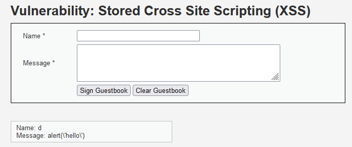
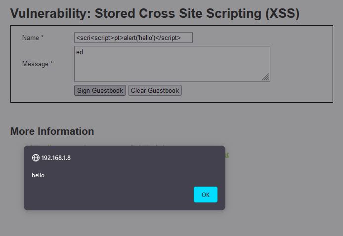

### Security level: LOW
# 
* Since this is in an extremely vulnerable state, we test it with a basic 
* Found some patterns to the sanization, or where characters are being escaped. Looks like <<meta>script> tags are being removed
#

#
* <<meta>body> tags are being sanitized completely, such as <body<meta> onload=alert(1)><meta>.
#

#
* At this point, it was time to look at the source code for any hints.
#

#
* It looks like the message text area strips any tags and adds slashes in the message after submission. Just like what we observed.
* But the name field doesn't have the same stringent rules for sanitization because it replaces 
#

