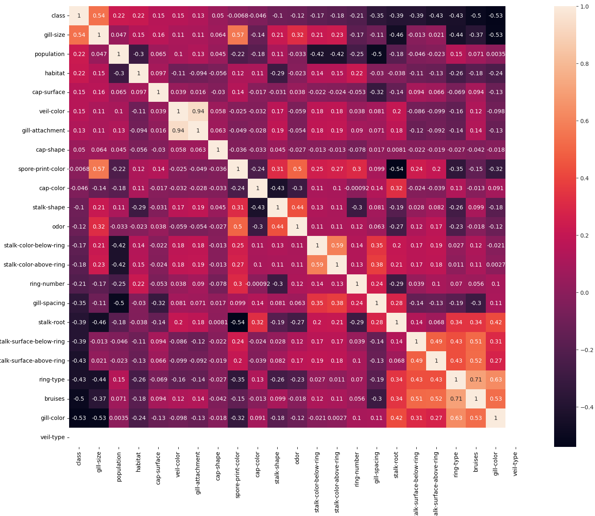

### [Poisonous mushroom features](https://github.com/Apl223/College-projects/blob/main/MushroomClassification/mushroom.ipynb)
* Built classification models to predict the edibility of mushrooms based on their physical characteristics. 
* Provides an accurate and reliable model that can help identify poisonous mushrooms and prevent potential health hazards. 
* Uses the Mushroom Data Set on [UCI](https://archive.ics.uci.edu/ml/datasets/mushroom) and employs various machine learning algorithms, such as logistic regression, SVM, and MLP to train and evaluate the models. 
* The project also includes exploratory data analysis and data visualization to gain insights into the dataset. 
* Used pandas, numpy, seaborn and matplotlib libraries.

### [Real estate prices](https://github.com/Apl223/College_and-Machine-Learning-projects/tree/main/RealEstatePrices)
* Machine learning project with pandas, sklearn, SQLite3, and Flask.
* Web application that provides an interface to allow users to upload CSV files containing similar real estate data to obtain precise predictions.
* Populating prediction results into a SQLite3 database then querying and displaying their results with Flask.
* Uses the Melbourne Housing Dataset
* Targets sale prices and uses a subset of columns in the set as features to predict housing prices. 
* Splits training and validation data to fit three different regressors in which the mean absolute error will be calculated and stored for each of them: Decision tree, Decision tree with a maximum limit of 100 nodes and Random Forest.

### [Analyzing stocks](https://github.com/Apl223/College_and-Machine-Learning-projects/tree/main/AnalyzingStocks-main)
* Web scraping Yahoo for Apple's stock history with BeautifulSoup, creating and inserting the data into a SQLite3 database, and using Flask to display it.

